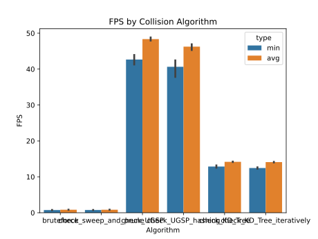
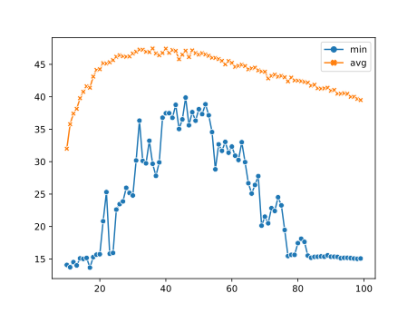

## FPS by Algorithm

### [Source Code](FPS_by_Algorithm.py)

## FPS by Tile Size on Uniform Grid Space Partitioning 

### [Source Code](FPS_by_Tile_Size.py)

# Brute Force

### [Source Code](cell_collision_sweep_and_prune.py)

check collision all of pairs

cell_collision_bruteforce.py

# Sweep and Prune

### [Source Code](cell_collision_sweep_and_prune.py)

sort by one axis and check only intersect object

# Uniform Grid Space Partitioning

### [Source Code](cell_collision_UGSP.py)

partitioning space and check only inside one space

# Uniform Grid Space Partitioning with Hashing

### [Source Code](cell_collision_UGSP_hashing.py)

UGSP with hashing

no memory waste by empty space

# KD tree

### [Source Code](cell_collision_KD_Tree.py)

partitioning space efficiently with KD tree

object can overlaps many of space

# KD tree iteratively

### [Source Code](cell_collision_KD_Tree_iteratively.py)

partitioning space efficiently with KD tree

python recursive function is extremly slow.

# Todo (may not be)

## Bouding Volumn Hierarchy

partitioning object efficiently

objects don't overlap

# Reference

https://youtu.be/eED4bSkYCB8

https://copyprogramming.com/howto/improving-performance-in-pygame
